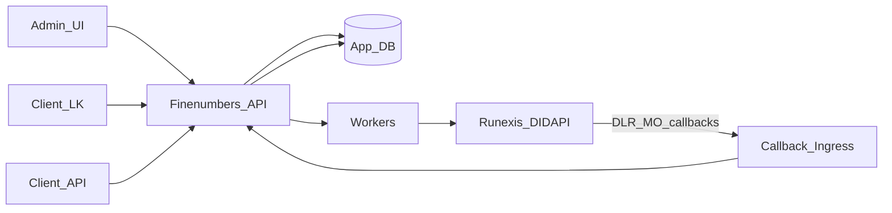

# Product feature → Runexis DIDAPI mapping

Reference docs: [`docs/reference/runexis/`](../reference/runexis/OVERVIEW.md).
Gaps: [`GAPS.md`](../reference/runexis/GAPS.md).

Assumption for v1: **one platform Runexis agent account**; clients are multiplexed in our DB via number assignment.

## Platform / Settings

| Product feature | Our responsibility | Runexis DIDAPI |
|---|---|---|
| Store agent credentials | `SystemSettings` (secret store) | `POST /api/v1/login`, `POST /api/v1/refresh` |
| Keep session alive | token cache + refresh before expiry | `/login`, `/refresh`, optional `/revoke-all` |
| Register global SMS callbacks | public ingress URLs in Settings | `PATCH /api/v1/sms/dlr-url`, `PATCH /api/v1/sms/hook-url` |
| Read global SMS settings | admin diagnostics | `GET /api/v1/sms/settings` |
| Client API keys | `ApiCredential` in our DB | none (our auth) |

## Admin — Clients

| Product feature | Our responsibility | Runexis DIDAPI |
|---|---|---|
| Create / update / delete client | `Client` + `ClientUser` CRUD | none |
| Suspend client | status flag; block LK/API | none |

## Admin — DEF numbers

| Product feature | Our responsibility | Runexis DIDAPI |
|---|---|---|
| Load purchased numbers | upsert `DefNumber` inventory from agent stock | `GET /api/v1/numbers/management` (all pages; no `number_status_id` filter) |
| Keep only SMS-capable numbers | 200 on per-number SMS settings = include; 4xx = skip (or `supports_sms=false` if already in DB). 200 ≠ send will work | `GET /api/v1/numbers/{number}/sms/account` |
| Assign number to client | open `NumberAssignment` | optional per-number SMS URL/directions setup |
| Unassign number | close assignment; stop authorization | optional clear per-number hooks |
| Enable SMS directions on number | policy from Settings | `PATCH /api/v1/numbers/{number}/sms/directions` (`in`, `dom_out`, `int_out`, `in_mass`) |
| Per-number callback override | usually unnecessary if global hooks used | `PATCH .../sms/dlr-url`, `PATCH .../sms/hook-url` |

**Do not expose in v1 UI:** `POST` buy/reserve/MNP, agreement binding, label/MAV flows.

## Client LK / API — Messaging

| Product feature | Our responsibility | Runexis DIDAPI |
|---|---|---|
| Send SMS | validate client owns `from_msisdn`; write `SmsMessage`; call provider | `POST /api/v1/sms/send` `{from_number, to_number, text}` — `to_number` is a JSON **string** (support 2026-08-14; HTML `number` is wrong). Success response still a gap |
| Delivery confirmations | update status from DLR +/or statistic | DLR callback URL (**payload gap**); `GET /api/v1/sms/statistic` |
| Receive SMS (inbox) | persist MO via ingress; list in LK | MO callback URL (**payload gap**); statistic with `incoming=true` as backfill |
| Message history | query `SmsMessage` (primary), statistic as reconciliation | `/api/v1/sms/statistic` |
| Group SMS campaign | `SmsCampaign` + worker fan-out | N × `/api/v1/sms/send` (no bulk API) |

### Status correlation strategy (until gaps close)

1. On send: store our `SmsMessage.id`; persist full provider response once known.
2. Prefer DLR callback keyed by provider `sms_id` when contract is known.
3. Fallback: poll/reconcile via `/sms/statistic` by time window + from/to MSISDN.
4. Never use `/numbers/{n}/sim/send-sms` for product traffic (informational SIM channel only).

## Callbacks vs lifecycle webhooks

| Channel | Purpose | Configuration |
|---|---|---|
| SMS DLR URL | outbound delivery reports | `/api/v1/sms/dlr-url` (+ optional per-number) |
| SMS hook URL | inbound SMS (MO) | `/api/v1/sms/hook-url` (+ optional per-number) |
| `/api/v1/webhooks` | number/SIM/MNP/lifecycle events | optional later; not required for SMS v1 inbox/DLR |

## Explicit non-mappings

| Tempting DIDAPI area | Why unused in v1 |
|---|---|
| Numbers purchase / booking | Admin loads already-bought DEF from management |
| Abonents / Agreements / Phys/Jur/IP | Telecom CRM, not SMS portal |
| Label / MAV / KSIM / Self-ban | Out of product scope |
| Operator API | Separate partner surface |
| SIM `send-sms` | Different channel; not product send |

## Implementation sequencing (recommended)

1. Settings + Runexis auth client (login/refresh)
2. Admin clients + DEF inventory + assignment
3. Global DLR/MO URL registration + ingress stubs (fixtures once gaps resolved)
4. Client send + message list
5. Campaign jobs
6. Client API credentials
7. Admin number sync via `/numbers/management` + `/sms/account`
